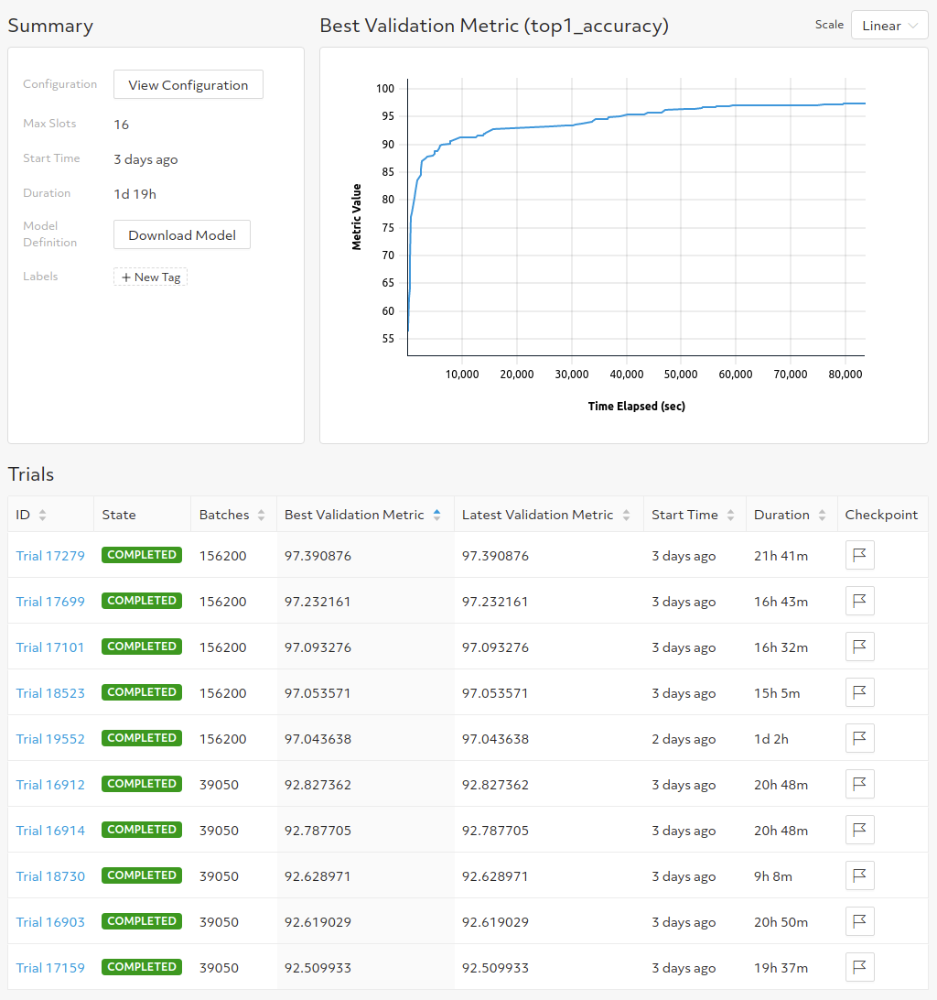

# NAS with state-of-the-art HP Search

Determined's adaptive search method implements [ASHA](https://arxiv.org/pdf/1810.05934.pdf),
a state-of-the-art method for HP search suitable for large-scale machine learning. In this example,
we use Determined's adaptive HP search to search for CNN architectures from [a common search space
used for neural architecture search (NAS)](https://arxiv.org/abs/1806.09055). In particular, we replicate
the NAS CNN search benchmark from the ASHA paper (Figure 4), which is [a strong baseline
for NAS](https://arxiv.org/abs/1902.07638).

We also demonstrate how HP search constraints can be used to boost the performance of adaptive hyperparameter search
to nearly match state-of-the-art for this search space.

## Files

- **model_def.py**: The core code for the model. This includes building and compiling the model.
- **model.py**: The model specification.
- **operations.py**: The components used to build the model.
- **utils.py**: Functions from the [original repository](https://github.com/quark0/darts).
- **genotypes.py**: Primitive set of model operations.

### Configuration Files

- **const.yaml**: Train the model with constant hyperparameter values. Provided architecture was found with constrained hp search and should reach > 97.4% accuracy.
- **adaptive.yaml**: Perform a hyperparameter search using Determined's state-of-the-art adaptive hyperparameter tuning algorithm.
- **constrained_adaptive.yaml**: Adaptive HP search over a modified search space using HP constraints.
- **constrained_random.yaml**: Random HP search over a modified search space using HP constraints.

## Data

This example searches for architectures over the CIFAR-10 dataset but is easily adaptable to other datasets.

## To Run

If you have not yet installed Determined, installation instructions can be found
under `docs/install-admin.html` or at https://docs.determined.ai/latest/index.html

Run the following command: `det -m <master host:port> experiment create -f 
adaptive.yaml .`. The other configurations can be run by specifying the appropriate
configuration file in place of `adaptive.yaml`.

## Expected Performance

When running HP search via `adaptive.yaml` with 16 V100 GPUs, the best architecture after 1 day should achieve around 97.0\% accuracy on CIFAR-10.

When running HP search via `constrained_adaptive.yaml` with 16 V100 GPUs, the best architecture after evaluating 1k trials should achieve around 97.3\% accuracy on CIFAR-10 as shown in the image below.  

_**Note:** For a fair comparison to the NAS results for this search space, you will have to train the best architecture for a total of 600 epochs instead of the 300 epochs used for the HP search experiment._
