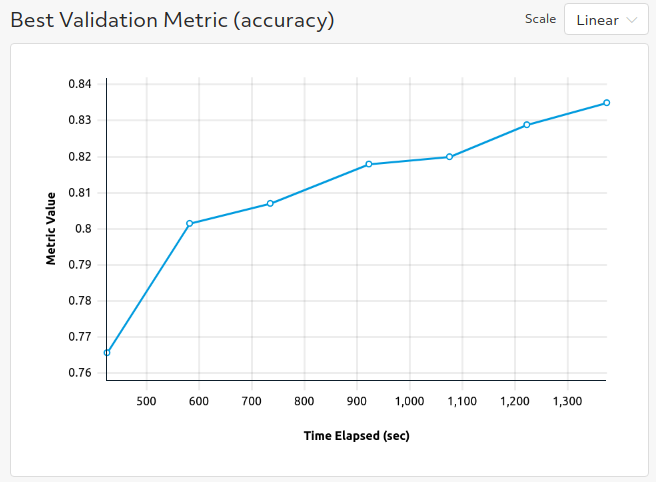

# Multiple Choice

This example mirrors the [multiple choice example](https://github.com/huggingface/transformers/tree/master/examples/pytorch/multiple-choice) from the original huggingface transformers repo for finetuning on the SWAG dataset.

## Files

- **swag_trial.py**: The [PyTorchTrial definition](https://docs.determined.ai/latest/reference/api/pytorch.html#pytorch-trial) for this example. A few class methods are overwritten and specialized for named-entity recognition but otherwise the behavior is the same as the [BaseTransformerTrial class](../model_hub/transformers/_trial.py).
- **data.py**: Modifies `DataCollatorForMultipleChoice` to work with PyTorchTrial.

### Configuration FIles

- **swag_config.yaml**: Experiment configuration for finetuning on the SWAG dataset with RoBERTa.

## To Run

If you have not yet installed Determined, installation instructions can be found
under `docs/install-admin.html` or at https://docs.determined.ai/latest/index.html

Make sure the environment variable `DET_MASTER` is set to your cluster URL.
Then you run the following command from the command line: `det experiment create -f swag_config.yaml .`.

## Configuration

To run with your own data, change the following fields in `swag_config.yaml`:

- `dataset_name: null` (This needs to be `null` so that we know to use the file paths specified below.)
- `train_file: <path_to_train_file>`
- `validation_file: <path_to_validation_file>`

The `train_file` and `validation_file` need to be in either csv or json format. By default, we follow the original example and
use a basic call to the `load_dataset` from the [huggingface datasets library](https://huggingface.co/docs/datasets) to parse the provided files.  
For more customized data loading, follow the instructions at https://huggingface.co/docs/datasets/loading_datasets.html.
The `build_datasets` method in `swag_trial.py` will likely also need to modified to work with custom data.

To run with multiple GPUs (whether single node or multiple nodes), change `slots_per_trial` to the desired
degree of parallelism. You will likely want to change `global_batch_size` so that each GPU will
process `global_batch_size / slots_per_trial` batches per iteration and adjust the `learning_rate`
to be compatible with a larger or smaller batch size.

Mix precision training with Apex Amp can be enabled by setting `use_apex_amp` to `true`.

## Results

Running with the provided experiment config `swag_config.yaml` yields an accuracy of ~83.4.

