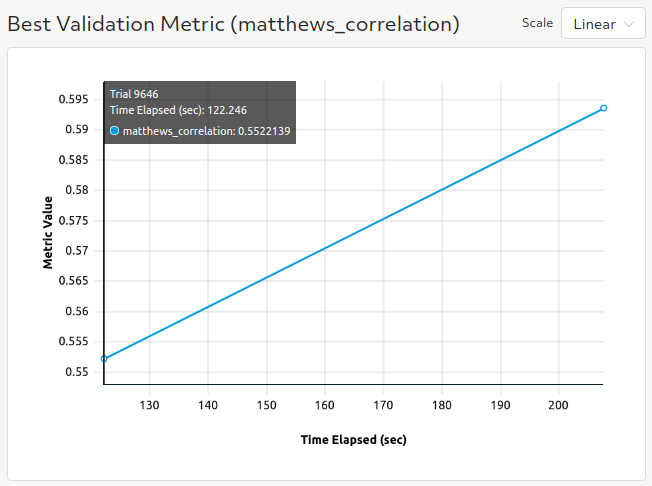
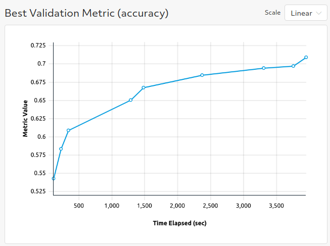

# Text Classification

The two examples here mirror the [text-classification examples](https://github.com/huggingface/transformers/tree/master/examples/pytorch/text-classification) from the original huggingface transformers repo.

## GLUE Benchmark

### Files

- **glue_trial.py**: The [PyTorchTrial definition](https://docs.determined.ai/latest/reference/api/pytorch.html#pytorch-trial) for this example. A few class methods are overwritten and specialized for text classification but otherwise the behavior is the same as the [BaseTransformerTrial class](../model_hub/transformers/_trial.py).

#### Configuration Files

- **glue_config.yaml**: Experiment configuration for finetuning on GLUE datasets with Bert.

### Configuration

To run with your own data, change the following fields in `glue_config.yaml`:

- `dataset_name: null` (This needs to be `null` so that we know to use the file paths specified below.)
- `train_file: <path_to_train_file>`
- `validation_file: <path_to_validation_file>`

If you want to use custom data, the `train_file` and `validation_file` need to be in either csv or
json format. See the trial definition for more guidance on how to use custom data files.

To run with multiple GPUs (whether single node or multiple nodes), change `slots_per_trial` to the desired
degree of parallelism. You will likely want to change `global_batch_size` so that each GPU will
process `global_batch_size / slots_per_trial` batches per iteration and adjust the `learning_rate`
to be compatible with a larger or smaller batch size.

Mix precision training with Apex Amp can be enabled by setting `use_apex_amp` to `true`.

### Results

Using the provided experiment config `glue_config.yaml` yields a Matthew's Correlation of ~59 on the CoLA dataset.

## XNLI Dataset

### Files

- **xnli_trial.py**: The [PyTorchTrial definition](https://docs.determined.ai/latest/reference/api/pytorch.html#pytorch-trial) for this example. A few class methods are overwritten and specialized for text classification on XNLI but otherwise the behavior is the same as the [BaseTransformerTrial class](../model_hub/transformers/_trial.py).

#### Configuration Files

- **xnli_config.yaml**: Experiment configuration for finetuning on the XNLI dataset with Bert.

### Configuration

Custom data is not supported with this example.

To run with multiple GPUs (whether single node or multiple nodes), change `slots_per_trial` to the desired
degree of parallelism. You will likely want to change `global_batch_size` so that each GPU will
process `global_batch_size / slots_per_trial` batches per iteration and adjust the `learning_rate`
to be compatible with a larger or smaller batch size.

Mix precision training with Apex Amp can be enabled by setting `use_apex_amp` to `true`.

### Results

Using the provided experiment config `xnli_config.yaml` yields a validation accuracy of ~70.9.

## To Run

If you have not yet installed Determined, installation instructions can be found
under `docs/install-admin.html` or at https://docs.determined.ai/latest/index.html

Make sure the environment variable `DET_MASTER` is set to your cluster URL.
Then you run the following command from the command line: `det experiment create -f <experiment_config> .`.
